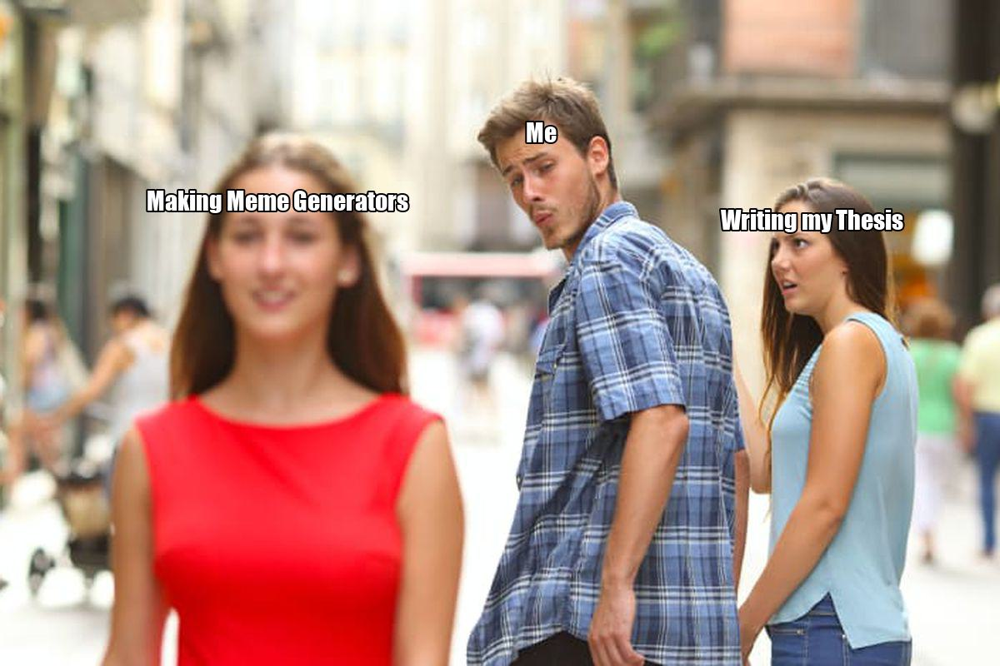

# cli-meme-generator
A command-line tool for creating memes of common formats.  

## Features
* Supports the classic meme format with top/bottom text for any image.
* Supports memes with text in non-standard locations, if the meta data is given.
* Adding your own image macros is as simple as adding them to the `data/images` folder, and adding meta_data to `data/meta_data.txt` if they aren't top/bottom text memes.
* "Deep-Frying" of memes inspired by [r/deepfriedmemes](https://www.reddit.com/r/DeepFriedMemes/).

## How to use
Declare the name (or partial name) of the template you want to use followed by a number of text strings corresponding to the expected amount of text on the meme.

Optional Arguments:
* `--deepfry` or `-df`: For when you want your meme way past well done.
* `--save` or `-s`: If you want to save the meme as a file. If left out the meme will be displayed, but not saved.

Example of use:
```
python create_meme.py boyfriend 'Making Meme Generators' 'Me' 'Writing my Thesis' -s example
```
creates the following meme:  


## Requirements  
`Pillow` for image manipulation.

## TODO
* Add more meme templates.
* Add the ability to overlay images on top of the memes for personal flair, like your friend as the distracted boyfriend.
